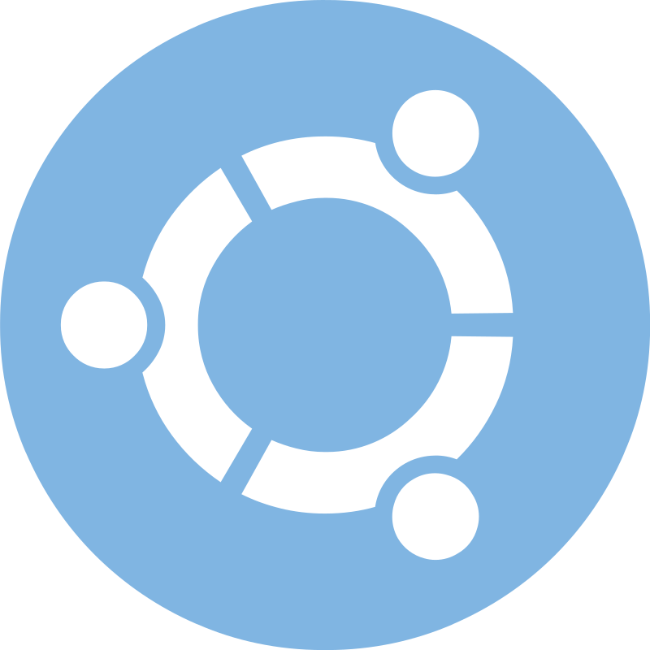

>“This is why so many of the best programmers are libertarians. In our world, you sink or swim, and there are no excuses. When those far removed from the creation of wealth – undergraduates, reporters, politicians – hear that the richest 5% of the people have half the total wealth, they tend to think injustice! An experienced programmer would be more likely to think is that all? The top 5% of programmers probably write 99% of the good software.”
— 《Hackers & Painters》 Paul Graham

<code></code>
<code></code>
<code></code>
<code></code>
<code></code>
<code></code>
<code></code>
<code></code>

<code></code>
<code></code>
<code></code>
<code></code>
<code></code>
<code></code>
<code></code>
<code></code>

<code></code>
<code></code>
<code></code>

<code></code>
<code></code>

   
